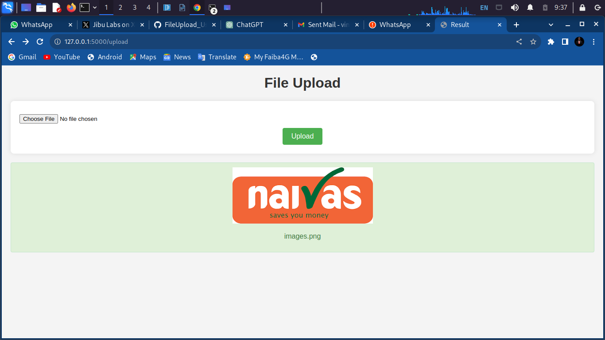
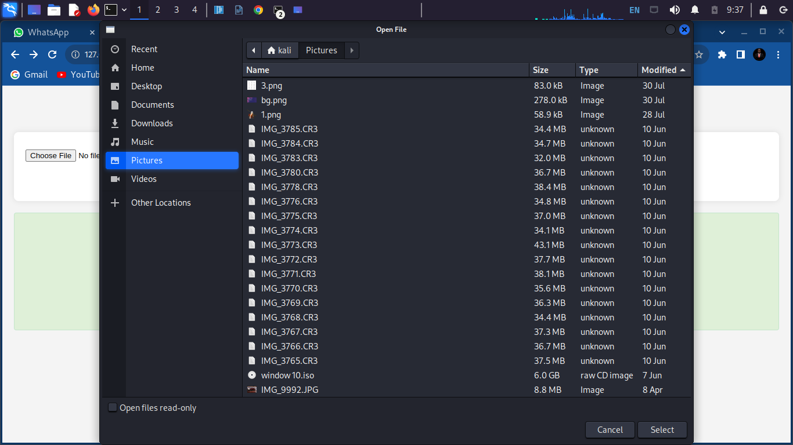

# Online File Upload Platform with Flask

## Overview

This Flask application allows users to easily upload files to online platforms. It provides a simple interface for uploading files, and you can customize it to connect with various online services.

## Features

- File upload functionality.
- Integration with online platforms.

## Screenshots

Include screenshots to visually guide users on how to use your application.

### Home Page



- The home page where users can start the file upload process.

### File Selection



- The file upload page where users can select and upload files.

## Getting Started

Follow these steps to set up and run the application.

### Prerequisites

Make sure you have the following installed:

- Python
- Flask
- Virtualenv

### Installation

1. Clone the repository:

    ```bash
    git clone https://github.com/OnpointSoftwares/FileUpload_Using_Flask/
    cd your-repository
    ```

2. Create and activate a virtual environment:

    ```bash
    virtualenv venv
    source venv/bin/activate  # On Windows, use `venv\Scripts\activate`
    ```

3. Install the required packages:

    ```bash
    pip install -r requirements.txt
    ```

### Usage

1. Run the application:

    ```bash
    python app.py
    ```

2. Open your web browser and go to [http://localhost:5000](http://localhost:5000).

3. Follow the on-screen instructions to upload files to online platforms.

## Configuration

If your application requires any configuration, explain how users can configure it.

## Contributing

We welcome contributions! Please check the [CONTRIBUTING.md](CONTRIBUTING.md) file for guidelines.

## License

This project is licensed under the [Your License](LICENSE) - see the [LICENSE](LICENSE) file for details.

## Acknowledgments

- Mention any resources, libraries, or inspiration you used in your project.

## Contact

For any questions or issues, feel free to contact us at [vincentbettoh@gmail.com](mailto:vincentbettoh@gmail.com).

